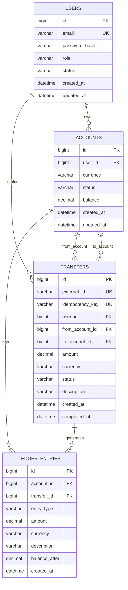

```mermaid
erDiagram
  USERS {
    bigint id PK
    varchar email UK
    varchar password_hash
    varchar role
    varchar status
    datetime created_at
    datetime updated_at
  }

  ACCOUNTS {
    bigint id PK
    bigint user_id FK
    varchar currency
    varchar status
    decimal balance
    datetime created_at
    datetime updated_at
  }


  TRANSFERS {
    bigint id PK
    varchar external_id UK
    varchar idempotency_key UK
    bigint user_id FK
    bigint from_account_id FK
    bigint to_account_id FK
    decimal amount
    varchar currency
    varchar status
    varchar description
    datetime created_at
    datetime completed_at
  }

  LEDGER_ENTRIES {
    bigint id PK
    bigint account_id FK
    bigint transfer_id FK
    varchar entry_type
    decimal amount
    varchar currency
    varchar description
    decimal balance_after
    datetime created_at
  }

  USERS ||--o{ ACCOUNTS : owns
  USERS ||--o{ TRANSFERS : initiates
  ACCOUNTS ||--o{ TRANSFERS : from_account
  ACCOUNTS ||--o{ TRANSFERS : to_account
  ACCOUNTS ||--o{ LEDGER_ENTRIES : has
  TRANSFERS ||--o{ LEDGER_ENTRIES : generates

```
